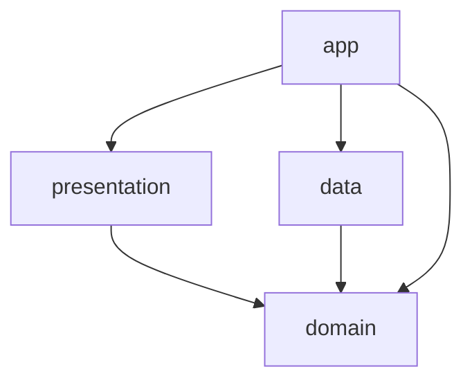

# Minary — AGENTS.md

> **BLUF (Bottom-Line Up Front)**
> Minary는 Room/DataStore를 SSOT(Single Source of Truth)로 사용하는 **Offline-first** AI 다이어리 앱이다. 네트워크 상태와 무관하게 모든 핵심 기능이 동작해야 하며, Firebase Firestore(Blaze 플랜) 비용 방어와 LWW(Last-Write-Wins) 동기화가 아키텍처의 핵심이다.

## 1. 아키텍처 및 의존성 방향 (엄격 준수)
- **패턴**: Clean Architecture + Orbit MVI + UDF(단방향 데이터 흐름)
- **의존성 방향**:
    - `app` -> `presentation` -> `domain`
    - `app` -> `data` -> `domain`
- **데이터 모델 명명 규칙**: 계층 간 모델 혼동을 방지하기 위해 다음 접미사(Suffix) 규칙을 엄격히 준수한다.
    - `domain`: 순수 명칭 (예: `User`, `Diary`)
    - `presentation`: `UiModel` (예: `UserUiModel`)
    - `data`: `Entity` (Local), `Dto` (Remote)
- **절대 금지**: 상위 모듈이 하위 모듈을 참조하는 역방향 의존성(`domain`이 `data`나 `presentation`을 참조) 절대 금지.
- **모듈간 협력**: Firebase 경로 등 모듈 간 공유되는 규약 수정 시, 클라이언트(`data`)와 서버(`firebase-server`)를 동시 수정해야 한다.

## 2. 커뮤니케이션 및 언어 규칙
- **기본 언어**: 에이전트의 모든 출력(진행 상황 보고, 답변, 구현 계획, 검증 결과 등)은 **한국어**를 원칙으로 한다.
- **기술 용어**: 전문적인 기술 용어, 코드 참조, 에러 메시지 등은 정확한 전달을 위해 영어 원문을 그대로 사용하거나 병기한다.
- **보고 형식**: 복잡한 작업은 `task.artifact.md`를 통해 가독성 있게 구조화하여 보고한다.

## 3. 데이터 흐름 및 동기화 (Offline-First)
- **SSOT**: 모든 UI(`presentation`)는 오직 Local DB(Room/DataStore)의 `Flow`만 구독한다.
- **Write 흐름**: UI -> UseCase -> Local DB 갱신(UI 즉시 반영) -> Sync Worker 예약 -> Remote(Firebase) 반영
- **LWW 충돌 해결**: 동기화 기준 시간은 절대 클라이언트 기기 시간(`System.currentTimeMillis()`)을 쓰지 않는다. 반드시 `ServerTimeProvider` (TrueTime 기반)를 사용해 `lastModifiedAt`을 갱신 및 비교한다.

## 4. 기술 스택 및 라이브러리 관리 규칙
- **의존성 기준 선언**: 프로젝트의 모든 기술 스택(Kotlin, Compose, Orbit MVI, Room, Firebase, WorkManager, Hilt, Gemini AI 등)은 **`gradle/libs.versions.toml`** 파일에 선언된 버전 카탈로그를 유일한 기준으로 삼는다. 새로운 라이브러리 도입 시 반드시 이 파일에 먼저 등록해야 한다.
- **하드코딩 금지**: 각 모듈의 `build.gradle.kts`나 소스 코드 내부에 라이브러리 버전 번호를 직접 입력하는 하드코딩을 엄격히 금지한다. 모든 의존성 참조는 반드시 `libs.*` alias를 통해 버전 카탈로그와 일관성을 유지해야 한다.
- **에러 핸들링**: `try-catch` 대신 `kotlin-result` 라이브러리를 활용한 함수형 에러 처리를 전 모듈에 적용한다.

## 5. AI 코드 생성 및 프로젝트 구조
- **주석 보존**: 기존 주석을 함부로 삭제하지 않는다. 코드 수정 시 로직 설명이나 의사결정 근거가 담긴 주석은 최대한 유지하며, 필요한 경우 보강한다.
- **구조 우선 순위**: 새로운 기능 추가 시 반드시 다음 순서를 따르며, 기존 패키지나 클래스가 존재할 경우 새 패키지 생성보다 기존 구조를 우선 활용하고 확장한다.
    1. **Domain**: 계약(Contract) 우선 정의. 도메인 모델 / Repository 인터페이스 / UseCase 추가.
    2. **Data**: Entity/DTO/Mapper/DataSource/RepositoryImpl 추가 (SyncManager/Worker 포함).
    3. **Presentation**: UiModel/Mapper/State/SideEffect/Action/ViewModel/Screen/Graph 추가.
    4. **App**: Hilt binding 및 Navigation Route 등록 등 최종 조립.

- **firebase-server**: 독립 배포 모듈 (클라이언트와 경로 동기화 필수)

## 6. 버전 관리 및 협업 규칙 (Git & GitHub)
- **로컬 커밋**: Git을 통해 로컬에 커밋할 때는 반드시 `.gitmessage.txt` 템플릿 파일을 참고하여 형식에 맞게 작성한다.
- **GitHub Issue & PR**: GitHub MCP를 이용해 이슈를 관리하거나 PR을 생성할 때는 프로젝트 내 `.github/` 폴더 하위의 템플릿 파일들을 최우선으로 참조한다.
    - 이슈: `.github/ISSUE_TEMPLATE/` (bug.md, feat.md 등)
    - PR: `.github/pull_request_template.md`