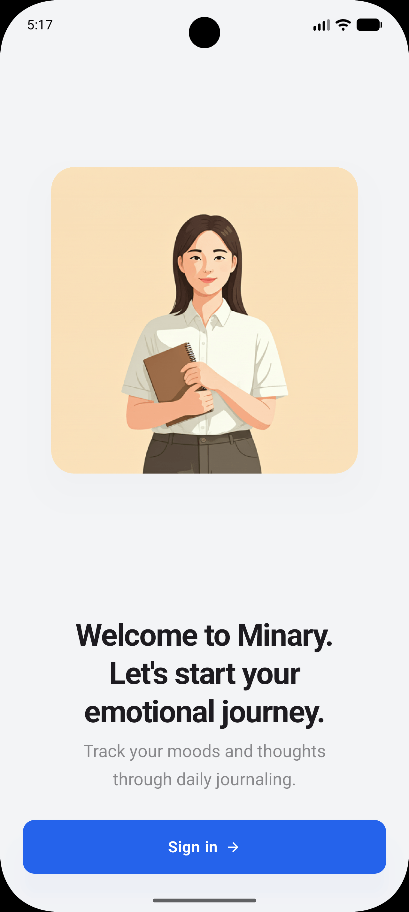
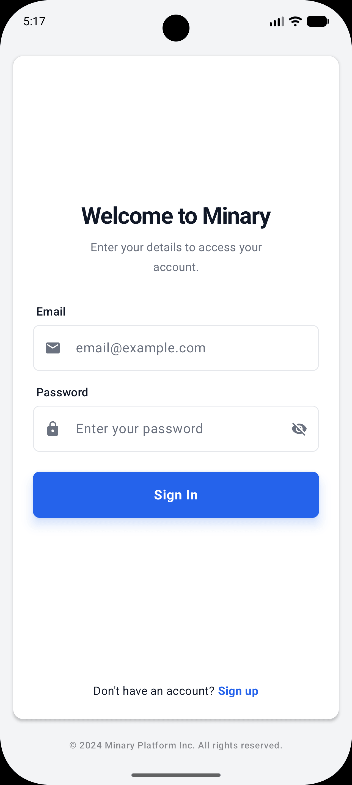
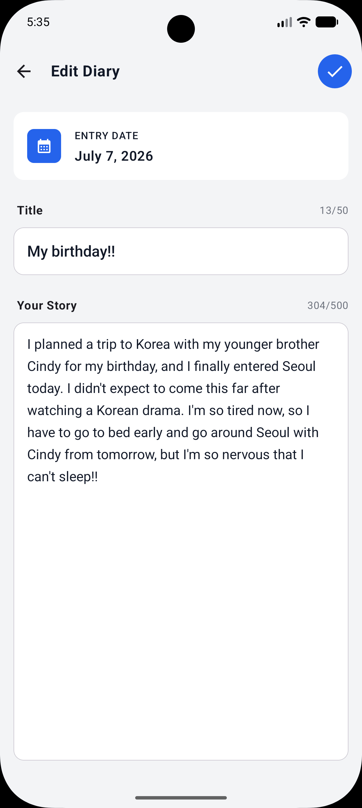
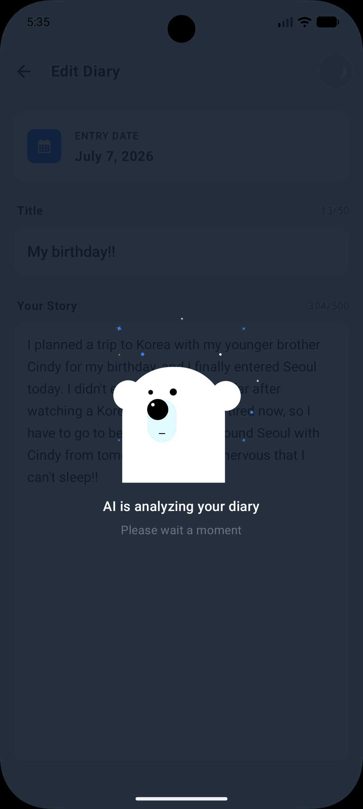
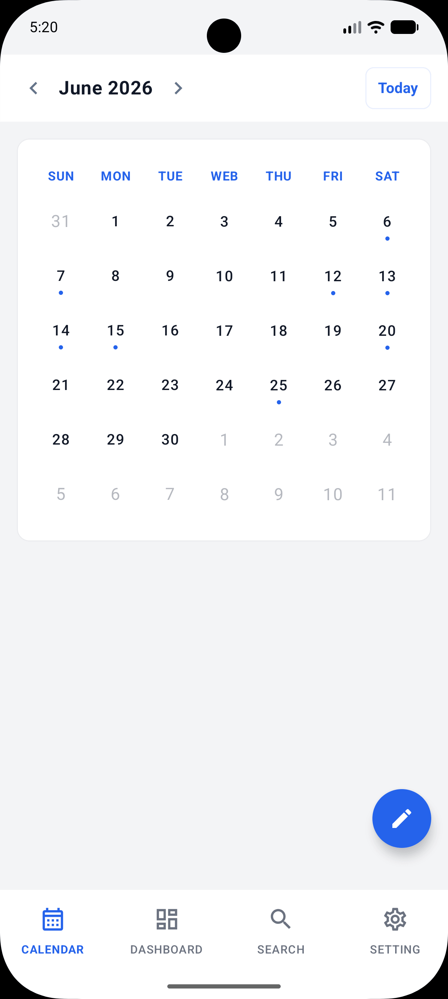
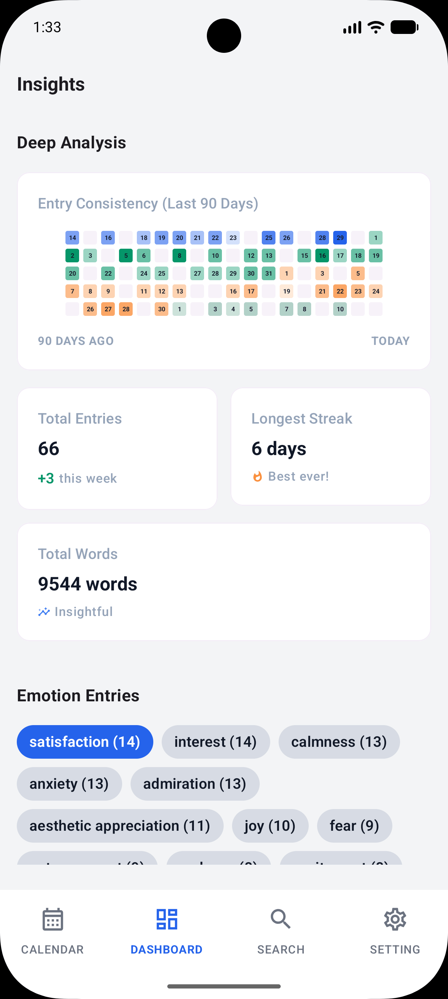
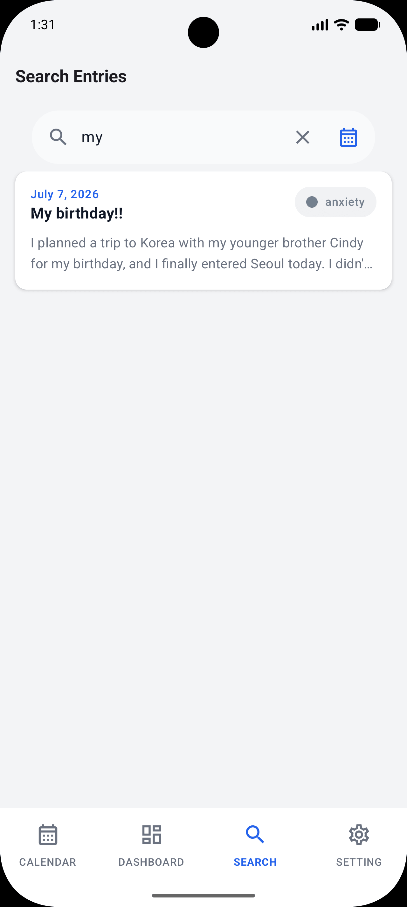
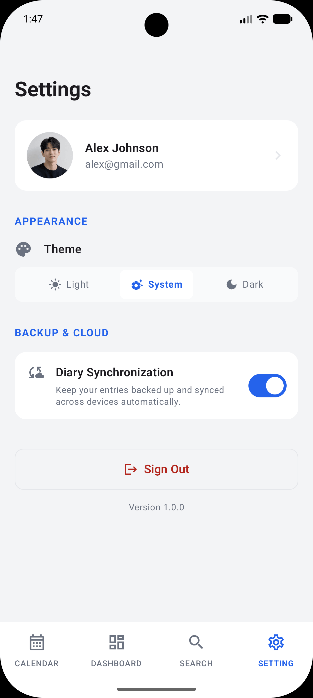
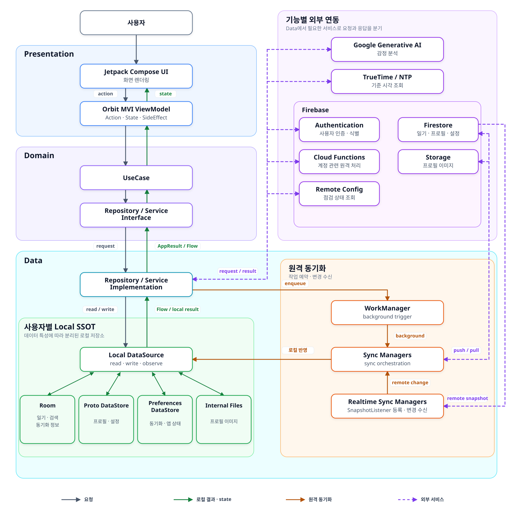

# Minary

> 하루의 생각을 일기로 남기고, AI가 분석한 감정과 기록의 흐름을 캘린더 · 대시보드에서 돌아보는 Android 앱

[](https://github.com/changoh-kim/minary/actions/workflows/android-fast.yml)
    [](./LICENSE)

Minary는 사용자의 일기 작성 흐름을 끊지 않고 기록을 보존하는 것을 중심으로 설계했습니다. 네트워크가 불안정하거나 AI 분석에 실패하더라도 일기 저장을 계속하고, 후행 동기화를 통해 다른 기기에서도 기록을 이어서 확인할 수 있도록 구현했습니다.

<sub>개인 프로젝트 · 기획 · 설계 · 개발 · 테스트 · 문서화 전 과정 담당</sub>

## 목차

- [핵심 강점](#핵심-강점)
- [앱 미리보기](#앱-미리보기)
- [주요 기능](#주요-기능)
- [기술 스택](#기술-스택)
- [아키텍처](#아키텍처)
- [기술 설계와 검토](#기술-설계와-검토)
- [테스트 및 CI](#테스트-및-ci)
- [실행 방법](#실행-방법)
- [라이선스](#라이선스)

## 핵심 강점

| 핵심 강점 | 한 줄 요약 |
| :--- | :--- |
| **Offline-first 기반 Local SSOT** | Room · Proto DataStore · Internal Files를 사용자별 로컬 기준 저장소로 사용해, 네트워크 연결 여부와 관계없이 기록을 조회 · 저장합니다. |
| **멀티 디바이스 동기화와 LWW** | `SnapshotListener`와 WorkManager로 실시간 · 백그라운드 동기화를 처리하고, NTP[^1] 동기화 시각을 우선하는 client timestamp 기반 LWW[^2] 규칙으로 충돌 시 반영할 데이터를 선택합니다. |
| **AI 분석 실패 격리** | AI 분석에 실패하거나 응답을 해석할 수 없으면 감정 상태를 `UNKNOWN`으로 대체하고, 일기 저장은 그대로 계속 진행합니다. |
| **Clean Architecture와 계층 간 오류 계약** | Presentation · Domain · Data 계층과 모듈 책임을 분리하고, 계층 간 실패는 `DomainError`와 `AppResult<T>`로 전달합니다. |
| **계층별 테스트와 반복 가능한 검증** | Presentation · Domain · Data · 로컬 저장소 · Firebase 연동을 계층별 전략으로 검증하고, 로컬 스크립트로 CI 흐름을 재현합니다. |

[^1]: NTP(Network Time Protocol): 네트워크 시간 서버와 시각을 동기화하기 위한 프로토콜로, 기기 설정 시각의 오차를 줄이는 데 사용합니다.   
[^2]: LWW(Last Write Wins): 데이터 충돌 시 수정 시각을 비교해 더 최근에 수정된 데이터를 선택하는 방식입니다.

## 앱 미리보기

<p align="center">
  
</p>

<p align="center"><sub>앱 실행부터 로그인 · 일기 작성 · 감정 분석 · 기록 확인으로 이어지는 주요 사용 흐름</sub></p>

<div align="center">
  <picture>
    <source media="(prefers-color-scheme: dark)" srcset="./docs/images/welcome_screen_dark.png">
    
  </picture>
  <picture>
    <source media="(prefers-color-scheme: dark)" srcset="./docs/images/signin_screen_dark.png">
    
  </picture>
  <picture>
    <source media="(prefers-color-scheme: dark)" srcset="./docs/images/edit_diary_screen_dark.png">
    
  </picture>
  <picture>
    
  </picture>
  <br />
  <picture>
    <source media="(prefers-color-scheme: dark)" srcset="./docs/images/monthly_calendar_screen_dark.png">
    
  </picture>
  <picture>
    <source media="(prefers-color-scheme: dark)" srcset="./docs/images/dashboard_screen_dark.png">
    
  </picture>
  <picture>
    <source media="(prefers-color-scheme: dark)" srcset="./docs/images/search_screen_dark.png">
    
  </picture>
  <picture>
    <source media="(prefers-color-scheme: dark)" srcset="./docs/images/settings_screen_dark.png">
    
  </picture>
</div>

<p align="center"><sub>주요 화면 구성</sub></p>

## 주요 기능

| 기능 | 사용자 경험 | 핵심 처리 방식 |
| --- | --- | --- |
| **계정 관리** | 회원가입 · 회원탈퇴 | Cloud Functions가 Firebase Auth · Firestore · Storage의 원격 작업을 조율합니다. 회원탈퇴 처리의 성공 응답을 받은 뒤 앱의 동기화를 중단하고 사용자별 로컬 데이터를 삭제합니다. |
| **사용자 인증** | 로그인 · 로그아웃 | 계정 전환 시 이전 사용자의 로컬 데이터를 초기화하고 새로운 사용자의 로컬 데이터베이스를 준비합니다. 또한, 로그아웃 시에는 필수 동기화 스케줄을 제외한 모든 동기화 작업(실시간, 백그라운드)을 즉시 중단합니다. |
| **일기 작성** | 일기 작성 · 수정 · 삭제와 AI 감정 분석 | 제목과 본문의 유효성(제목 최대 50자, 본문 최대 500자)을 검증하고 AI 감정 분석을 시도합니다. 분석에 실패하면 감정 상태를 `UNKNOWN`으로 대체해 로컬에 저장하고, 설정에 따라 백그라운드 동기화를 예약합니다. |
| **캘린더** | 날짜별 일기 확인 | 캘린더 화면에 필요한 일기 데이터를 불러옵니다. |
| **대시보드** | 활동 기록 · 통계 확인 | 누적된 일기 데이터를 집계해 최근 90일 활동표(Heatmap)와 전체 기간의 감정 통계를 표시합니다. |
| **기록 검색** | 제목 · 본문 · 기간별 검색 | 사용자가 지정한 기간과 검색어에 맞는 일기를 불러오고, 최근 검색어를 저장하고 표시합니다. |
| **앱 설정** | 프로필 · 테마 · 일기 동기화 설정 | 사용자가 수정한 프로필과 테마를 앱에 즉시 반영하고, 설정에 따라 일기 동기화 기능을 제어합니다. |
| **서비스 점검** | 서비스 점검 확인 | 앱 실행 또는 포그라운드 복귀(`onResume`) 시점마다 점검 상태를 확인하고, 필요 시 점검 안내 화면을 표시합니다. |

## 기술 스택

| 카테고리 | 기술 |
| :--- | :--- |
| **Language** | Kotlin |
| **UI & UX** | Jetpack Compose · Material 3 · Navigation Compose · Coil · Lottie |
| **Architecture** | Clean Architecture · Multi-module Architecture · [Orbit MVI](https://github.com/orbit-mvi/orbit-mvi) · UDF |
| **DI** | Hilt |
| **Async & Background** | Coroutines · Flow · WorkManager |
| **Local Data** | Room · DataStore · Paging 3 |
| **Backend** | Firebase (Authentication · Firestore · Storage · Cloud Functions · Remote Config) |
| **Security** | Firebase App Check (Play Integrity) |
| **AI** | Google Generative AI SDK |
| **Testing** | JUnit · MockK · [Turbine](https://github.com/cashapp/turbine) · Robolectric · Espresso · Compose UI Test |
| **Build & CI** | Gradle · Android Gradle Plugin · KSP · GitHub Actions |
| **Utilities** | [Kotlin Result](https://github.com/michaelbull/kotlin-result) · Timber · [TrueTime](https://github.com/instacart/truetime-android) |

## 아키텍처

Minary의 아키텍처는 실행 중 데이터가 이동하는 흐름과, 이를 뒷받침하는 계층·모듈의 의존 관계로 나누어 설명할 수 있습니다.

### 데이터 흐름

[](docs/images/architecture_overview.svg)

- **요청 전달:** UI의 `Action`은 Orbit MVI `ViewModel`과 `UseCase`를 거쳐 Domain의 `Repository` · `Service` 계약으로 전달되고, Data 구현체가 필요한 데이터 소스나 외부 서비스를 호출합니다.
- **로컬 기준 처리:** 화면은 Firebase 응답을 직접 사용하지 않습니다. Data가 사용자별 Local SSOT에 반영한 결과를 `Flow` 또는 `AppResult<T>`로 전달받고, `ViewModel`이 이를 `State`로 변환해 UI에 반영합니다.
- **원격 동기화와 외부 연동:** 로컬 변경은 WorkManager가 실행하는 `Worker`와 동기화 관리자를 통해 원격 저장소에 반영됩니다. Home 화면 진입 시 시작되는 실시간 동기화 관리자는 `SnapshotListener`로 Firestore 변경을 수신해 Local SSOT에 반영합니다. AI · NTP · Auth · Cloud Functions · Remote Config는 Data 경계에서 기능별로 호출됩니다.

### 계층 책임과 의존 방향

- **Presentation**: UI와 사용자 입력 및 이벤트를 처리하는 영역으로, Orbit MVI를 이용해 단방향 데이터 흐름(UDF)으로 관리합니다.
- **Domain**: 앱의 핵심 비즈니스 데이터와 규칙을 정의하는 영역으로 Model, UseCase 및 Repository, Service 인터페이스를 정의합니다.
- **Data**: 실제 데이터 소스를 도메인 형식으로 가공해 제공하는 영역으로 로컬 저장소와 Firebase, AI SDK와 통신합니다.

의존성 역전 원칙(DIP)을 준수하여 설계한 논리적인 의존 방향과 실제 프로젝트 내 모듈 관계는 다음과 같습니다.

```text
<논리적 의존 방향>
Presentation → Domain ← Data

<실제 모듈 의존 관계>
:app → :presentation, :data, :domain, :core:common, :core:di
:presentation → :domain, :core:common, :core:ui:common, :core:ui:design
:data → :domain, :core:common, :core:di, :core:database,
        :core:datastore, :core:firebase, :core:storage
:domain → :core:common
```

### 프로젝트 구조와 모듈 책임

| 카테고리 | 모듈 · 디렉터리 | 역할 |
| --- | --- | --- |
| App | `:app` | 앱 진입점과 전체 의존성 그래프(Hilt) 조립 · WorkManager와 Firebase 초기 설정 |
| Architecture | `:presentation` | Jetpack Compose UI와 Navigation 구현 · Orbit MVI 기반 단방향 데이터 흐름(UDF) 관리 |
| Architecture | `:domain` | Domain Model과 UseCase 정의 · 데이터 처리를 위한 인터페이스 제공 |
| Architecture | `:data` | Domain 인터페이스 구현 · Room/DataStore와 Firebase 데이터 통합 및 동기화 전략 수행 |
| Core | `:core:common` | 여러 계층이 공유하는 `Model`·`State`·`AppResult`·`DomainError`·`Logger` 계약 제공 |
| Core | `:core:database` | 사용자별 Room 데이터베이스 · DAO · Entity · 타입 변환 로직 관리 |
| Core | `:core:datastore` | Proto DataStore 스키마와 Serializer 정의 · 설정 및 상태 저장 기반 제공 |
| Core | `:core:firebase` | Firebase SDK 연동 캡슐화 · Firestore 경로와 Cloud Functions 호출 계약 관리 |
| Core | `:core:storage` | 사용자별 로컬 파일 경로 관리 · 파일 입출력 인터페이스 제공 |
| Core | `:core:di` | Coroutine 실행 환경(Dispatcher/Scope)과 공통 DI 식별자(Qualifier) 정의 |
| Core UI | `:core:ui:common` | UI 상태 래퍼 · 포맷 변환기 · Compose 확장 함수 등 공통 지원 도구 제공 |
| Core UI | `:core:ui:design` | Theme · Color · Typography와 재사용 가능한 UI 컴포넌트 제공 |
| Build | `build-logic` | 중복되는 Gradle 설정을 Convention Plugin으로 관리 |
| Server | `firebase-server` | Cloud Functions, Firestore 규칙 등 Firebase 백엔드 인프라 코드와 설정을 관리하는 독립 디렉터리 |

<details>
<summary>$\color{blue}{\text{프로젝트 디렉터리 구조 보기}}$</summary>

```text
Minary
├── app
├── presentation
├── domain
├── data
├── core
│   ├── common
│   ├── di
│   ├── database
│   ├── datastore
│   ├── firebase
│   ├── storage
│   └── ui
│       ├── common
│       └── design
├── build-logic
└── firebase-server
```

</details>

## 기술 설계와 검토

아키텍처와 기술 선택의 이유 · 결과를 트레이드오프(Trade-off) 관점에서 설명합니다. 현재 설계의 한계와 향후 개선 계획을 밝히고, 각 결정 아래에는 실제 구현을 확인할 수 있는 핵심 코드 진입점을 제공합니다.

### 기술적 의사결정

7가지 결정과 대표 트레이드오프를 먼저 요약하고, 각 결정의 배경과 코드 진입점은 아래에서 자세히 다룹니다.

| # | 결정 | 핵심 선택 | 대표 트레이드오프 |
| --- | --- | --- | --- |
| 1 | [로컬 기준 저장소 선택 (SSOT)](#1-로컬-기준-저장소-선택-ssot) | Room · DataStore를 SSOT로, Firestore는 메모리 캐시만 사용 | 원격 데이터와 로컬 데이터를 앱에서 직접 매핑 · 동기화 |
| 2 | [동기화 시점과 충돌 처리 (LWW)](#2-동기화-시점과-충돌-처리-sync-point-lww) | 동기화 흐름을 6가지로 분리, client timestamp 기반 LWW 적용 | 문서 단위 LWW라 필드별 동시 수정 시 한쪽이 덮어써질 위험 |
| 3 | [공통 오류 처리 (Error Handling)](#3-공통-오류-처리-error-handling) | `DomainError` + `AppResult`로 계층 간 오류 계약 통일 | 오류가 늘 때마다 변환 규칙과 메시지를 함께 관리 |
| 4 | [AI 분석 실패 격리](#4-ai-분석-실패-격리-graceful-degradation) | 실패 시 `UNKNOWN`으로 대체, 저장은 계속 진행 | AI 응답 지연이 저장 완료 시점에 영향, 실패 원인 구분 불가 |
| 5 | [서버 기반 계정 처리 (Cloud Functions)](#5-서버-기반-계정-처리-cloud-functions) | Cloud Functions가 계정 생성 · 삭제를 조율 | 원자적 트랜잭션 불가, 부분 실패 복구 로직 별도 구현 |
| 6 | [화면 상태와 이벤트 분리 (Orbit MVI)](#6-화면-상태와-일회성-이벤트-분리-orbit-mvi) | State · Action · SideEffect 분리, 단방향 흐름(UDF) 구축 | 보일러플레이트 증가, 학습 비용 발생 |
| 7 | [멀티모듈 빌드 설정 통합](#7-멀티모듈-빌드-설정-통합-version-catalog--convention-plugin) | Version Catalog + Convention Plugin으로 빌드 설정 통합 | 공통 설정 변경 시 전체 모듈 재검증 필요 |

표의 1\~3번 결정은 아래에서 배경과 트레이드오프를 자세히 다루고, 4\~7번은 접어 두었습니다.

#### 1. 로컬 기준 저장소 선택 (SSOT)

##### 핵심 결정
> - **UI 화면의 데이터 기준:** 데이터 특성에 맞춰 Room · DataStore · Internal Files를 사용자별 로컬 기준 저장소(Single Source of Truth, SSOT)로 사용합니다.
> - **Firebase의 역할:** Firestore SDK는 메모리 캐시만 사용하도록 제한하며, 원격 서버에서 수신한 변경 사항도 로컬 저장소를 거쳐 화면에 반영합니다.

##### 왜 선택했나
- Room과 Firestore의 영구 오프라인 캐시를 동시에 사용하면, 두 저장소 간의 동기화 시점 차이 때문에 어느 쪽 데이터가 진짜 최신 기준(Ground Truth)인지 모호해지는 정합성 문제가 생길 수 있기 때문입니다.
- 사용자별 데이터 격리, 데이터 보존 범위 설정, 로컬 DB 기반의 조회와 집계, 정밀한 동기화 상태 제어 등 시스템 전반을 앱에서 직접 주도적으로 관리하기 위해 로컬 저장소를 유일한 기준으로 선택했습니다.

##### 얻은 효과
- UI가 Firebase SDK의 초기화 상태나 네트워크 연결 여부에 직접 종속되지 않고 로컬 데이터를 기준으로 접근합니다.
- 오프라인 상태에서도 사용자가 새 기록을 저장하거나 기기에 보관된 과거 기록을 읽을 수 있으며, 데이터가 바뀌면 Room과 DataStore가 생성하는 `Flow`를 통해 화면에 반영됩니다.

##### 감수한 비용
- 다른 기기에서 Firebase로 올린 원격 데이터를 앱 내부의 로컬 엔티티 모델로 변환하고 저장하는 별도의 동기화 처리가 필요합니다.
- 로컬 모델과 원격 데이터의 스키마 매핑, 충돌 예외 처리, 동기화 진행 상태 등을 클라이언트 앱에서 구현하고 검증해야 하므로 관리 비용이 발생합니다.

##### 관련 코드

| 파일 | 설명 |
| --- | --- |
| [`UserDatabaseProvider.kt`](core/database/src/main/java/kr/co/core/database/provider/UserDatabaseProvider.kt) | UID별 Room DB 전환 · 삭제 |
| [`UserProfileDataStoreProvider.kt`](core/datastore/src/main/java/kr/co/core/datastore/profile/UserProfileDataStoreProvider.kt) | UID별 Proto DataStore 대표 구현 |
| [`LocalStoragePathProvider.kt`](core/storage/src/main/java/kr/co/core/storage/config/LocalStoragePathProvider.kt) | 사용자별 저장 파일명 · 경로 규칙 |
| [`FirebaseModule.kt`](app/src/release/java/kr/co/minary/di/FirebaseModule.kt) | Firestore 메모리 캐시 설정 |

#### 2. 동기화 시점과 충돌 처리 (Sync Point, LWW)

##### 핵심 결정
> - **실행 시점:** 동기화 목적과 환경에 맞춰 앱 시작 · 데이터 변경 직후 · 전체 동기화 · 정기 동기화 · 실시간 수신 · 과거 월 조회의 6가지 흐름으로 분리했습니다.
> - **충돌 규칙:** 데이터 충돌 시 앱에서 기록한 수정 시각을 비교해 더 최근 데이터를 선택하는 마지막 수정 우선(Last Write Wins, LWW) 규칙을 적용합니다. 수정 시각은 네트워크 시간 프로토콜(Network Time Protocol, NTP)로 동기화한 시각을 우선 사용하고, 해당 시각을 사용할 수 없으면 기기 시스템 시각을 사용합니다.

##### 왜 선택했나
- 사용자가 방금 수정한 내용을 서버에 보내는 일, 앱을 사용하지 않는 동안 놓친 데이터를 동기화하는 일, 다른 기기의 편집 사항을 실시간으로 받는 일은 각각 필요한 실행 시점과 조건이 다릅니다.
- 이 시나리오들을 하나의 기능으로 묶으면 불필요한 네트워크 요청이 발생하거나 데이터 반영이 늦어지고, 앱이 종료된 상황에서 백그라운드 작업을 처리하기 어렵기 때문입니다.

##### 얻은 효과
- 데이터 변경 직후, 설정에서 일기 동기화가 켜져 있으면 사용자가 수정한 일기 내용을 빠르게 Firebase에 반영합니다.
- 앱 진입 시점이나 전체 보정 단계에서는 데이터를 50건 단위로 나누어 처리합니다.
- 정기 동기화는 Wi-Fi · 충전 중 · 기기 유휴(Idle) 상태라는 제약 조건을 적용해 배터리와 데이터 사용을 제한합니다.

##### 감수한 비용
- 실시간 변경 리스너(`SnapshotListener`)와 백그라운드 스케줄러(`Worker`)가 동시에 구동될 수 있어, 현재 동기화 상태와 마지막으로 읽은 위치(Cursor)가 충돌하지 않도록 일관되게 관리해야 하는 복잡성이 있습니다.
- 필드 단위가 아니라 문서(Row) 전체를 기준으로 LWW 방식을 적용하기 때문에, 서로 다른 기기에서 같은 일기의 제목과 본문을 각각 다르게 고쳤더라도 한쪽의 수정사항이 통째로 덮어써질 위험이 있습니다.
- NTP 동기화 실패 시 차선책으로 쓰는 기기 자체 시각의 오차가 충돌 결과에 영향을 줄 수 있습니다.

##### 관련 코드

| 파일 | 설명 |
| --- | --- |
| [`DiarySyncWorkManager.kt`](data/src/main/java/kr/co/data/feature/diary/sync/DiarySyncWorkManager.kt) | 즉시 · 전체 · 정기 동기화 스케줄링과 제약 조건 |
| [`FirestoreDiaryRealtimeSyncManager.kt`](data/src/main/java/kr/co/data/feature/diary/sync/FirestoreDiaryRealtimeSyncManager.kt) | SnapshotListener 기반 실시간 변경 수신 |
| [`FirestoreDiarySyncManager.kt`](data/src/main/java/kr/co/data/feature/diary/sync/FirestoreDiarySyncManager.kt) | Push · Pull과 LWW 충돌 처리 |
| [`TrueTimeProvider.kt`](data/src/main/java/kr/co/data/service/time/TrueTimeProvider.kt) | NTP 우선 수정 시각 생성과 기기 시각 대체 |

#### 3. 공통 오류 처리 (Error Handling)

##### 핵심 결정
> - **공통 오류 형식:** 계층 간에 공개하는 실패는 `DomainError`라는 공통 규격으로 표현하고, 이를 통일된 반환 형식인 `AppResult<T>`에 담아 전달합니다. Firebase를 포함한 외부 SDK의 예외는 `ExceptionMapper`를 통해 공통 오류로 변환합니다.

##### 왜 선택했나
- 원시 오류 객체(`Throwable`)가 Presentation 계층까지 그대로 전달되면 `ViewModel`과 UI가 Firebase · 네트워크 · 외부 SDK별 오류를 직접 파악해야 합니다.
- 이 경우 화면마다 예외 대응 로직과 테스트 코드가 특정 SDK 구현에 종속되어 복잡해지고, Domain이 Data의 구체적인 구현을 알게 되어 의존성 역전 원칙(DIP)도 흐트러집니다.

##### 얻은 효과
- Domain과 Presentation 계층은 외부 SDK의 구체적인 예외 종류를 몰라도 공통 규격인 `DomainError`를 기준으로 재시도, 사용자 안내, 저장 지속 여부를 결정할 수 있습니다.
- 테스트 코드에서도 실제 Firebase 예외 대신 `DomainError` 값을 직접 구성해 화면별 분기를 검증할 수 있습니다.

##### 감수한 비용
- 새로운 비즈니스 오류가 추가될 때마다 `ExceptionMapper`의 변환 규칙과 `DomainError` 값 정의를 함께 확장해야 합니다.
- 화면별 오류 메시지와 분기 로직도 공통 체계 변경에 맞춰 같이 관리해야 하므로, 오류 종류가 늘어날수록 유지 비용이 커집니다.

##### 관련 코드

| 파일 | 설명 |
| --- | --- |
| [`DomainError.kt`](core/common/src/main/java/kr/co/core/common/error/DomainError.kt) | 공통 · 도메인 오류 유형 정의 |
| [`AppResult.kt`](core/common/src/main/java/kr/co/core/common/result/AppResult.kt) | 계층 간 성공 · 실패 전달 계약 |
| [`ExceptionMapper.kt`](data/src/main/java/kr/co/data/extension/ExceptionMapper.kt) | Firebase · 외부 SDK 예외 변환 |

<details>
<summary>$\color{blue}{\text{그 외 설계 결정 보기}}$</summary>

#### 4. AI 분석 실패 격리 (Graceful Degradation)

##### 핵심 결정
> - **AI 실패 대응:** AI 분석 실패는 Data 계층의 DataSource에서 `UNKNOWN` 감정으로 대체하고 일기 저장 프로세스를 계속 진행합니다.

##### 왜 선택했나
- 부가 기능인 AI 분석의 실패가 핵심 기능인 일기 저장 실패로 이어지면 사용자가 작성한 기록을 보존할 수 없기 때문입니다.

##### 얻은 효과
- 단계적 기능 축소(Graceful Degradation) 구조를 적용하여 AI 분석 서버에 문제가 생기거나 응답 파싱에 실패하더라도 사용자의 일기는 로컬 저장소에 저장됩니다.

##### 감수한 비용
- AI 분석 호출이 로컬 DB(Room) 트랜잭션보다 먼저 실행되는 순서이기 때문에, 외부 AI API의 응답이 느려지면 사용자의 일기 저장 완료 시점도 함께 늦어질 수 있습니다.
- `UNKNOWN` 상태값 하나만 사용하므로 사용자의 글이 짧아 감정을 추출하지 못한 경우와 AI 서버 오류로 분석에 실패한 경우를 구분하기 어렵습니다.

##### 관련 코드

| 파일 | 설명 |
| --- | --- |
| [`DiaryEditViewModel.kt`](presentation/src/main/java/kr/co/presentation/feature/diary/screen/edit/DiaryEditViewModel.kt) | 저장 요청과 화면 상태 처리 |
| [`CreateDiaryUseCase.kt`](domain/src/main/java/kr/co/domain/feature/diary/usecase/CreateDiaryUseCase.kt) | 생성 · 수정 시각과 동기화 상태 설정 |
| [`DiaryRepositoryImpl.kt`](data/src/main/java/kr/co/data/feature/diary/repository/DiaryRepositoryImpl.kt) | AI 분석 결과를 포함해 Room에 저장하고 즉시 동기화 예약 |
| [`EmotionRemoteDataSource.kt`](data/src/main/java/kr/co/data/feature/emotion/source/remote/EmotionRemoteDataSource.kt) | 분석 실패 · 빈 결과를 `UNKNOWN`으로 대체 |

#### 5. 서버 기반 계정 처리 (Cloud Functions)

##### 핵심 결정
> - **원격 처리:** 회원가입과 회원탈퇴 시 발생하는 Firebase Auth · Firestore · Storage 제어 작업은 앱에서 직접 순차 호출하지 않고, 호출 가능한 서버 함수(Callable Cloud Functions)에서 일괄 조율하도록 설계했습니다.
> - **로컬 처리:** 회원탈퇴 시 백엔드 처리가 성공했다는 응답을 받으면 앱에서 진행 중인 동기화 작업을 중지하고 사용자별 로컬 데이터를 삭제합니다.

##### 왜 선택했나
- 클라이언트 앱에서 여러 Firebase 서비스를 차례대로 묶어 처리하면, 중간 단계에서 네트워크 단절 등으로 실패했을 때 각 인프라 서비스마다 데이터 정합성이 깨진 채 비정상적인 상태가 남기 때문입니다.
- 클라이언트가 처리 순서, 접근 권한, 실패 시 롤백과 재시도 방법까지 책임지면 코드가 복잡해지고, 백엔드 처리 규칙이 앱 소스 코드에 노출되는 위험이 있습니다.

##### 얻은 효과
- 앱은 회원가입과 회원탈퇴에 각각 대응하는 Callable Function을 호출하면 되므로 외부 Firebase 서비스에 대한 결합도가 낮아졌고, 서버가 각 작업의 처리 순서를 담당합니다.
- 서버의 원격 데이터 처리 영역과 앱의 동기화 중지 · 로컬 데이터 정리 영역이 명확하게 이원화되어 서버와 앱의 책임이 분리되었습니다.

##### 감수한 비용
- Cloud Functions를 활용하더라도 Firebase Auth · Firestore · Storage의 원격 처리와 기기의 로컬 데이터 정리를 하나의 원자적 트랜잭션으로 묶을 수는 없습니다.
- 네트워크 유실로 인한 중간 단계 실패나 중복 요청에 대비해 되돌리기(Rollback), 중복 실행 방지(Idempotency), 부분 실패 재시도와 로컬 상태 복구 절차를 별도로 구현해야 합니다.

##### 관련 코드

| 파일 | 설명 |
| --- | --- |
| [`CreateAccountUseCase.kt`](domain/src/main/java/kr/co/domain/feature/account/usecase/CreateAccountUseCase.kt) | 가입 시각 생성과 계정 생성 요청 |
| [`DeleteAccountUseCase.kt`](domain/src/main/java/kr/co/domain/feature/account/usecase/DeleteAccountUseCase.kt) | 서버 처리 후 동기화 중지와 로컬 데이터 정리 |
| [`AccountRemoteDataSource.kt`](data/src/main/java/kr/co/data/feature/account/source/remote/AccountRemoteDataSource.kt) | 재인증과 Callable Function 호출 |
| [`index.ts`](firebase-server/functions/src/index.ts) | Auth · Firestore · Storage 서버 처리 조율 |

#### 6. 화면 상태와 일회성 이벤트 분리 (Orbit MVI)

##### 핵심 결정
> - **역할 분리:** 화면에 유지되는 값(`State`), 사용자의 입력과 클릭(`Action`), 한 번만 실행할 화면 이동과 메시지 출력(`SideEffect`)을 명확히 분리했습니다.
> - **단방향 흐름:** Orbit MVI의 `intent` 블록이 사용자 행동과 비동기 처리 결과를 수집하고, 오직 `reduce` 블록을 통해서만 화면 상태를 갱신하도록 구성하여 단방향 데이터 흐름(Unidirectional Data Flow, UDF)을 구축했습니다.

##### 왜 선택했나
- 사용자 입력, 비동기 작업 결과, UI 상태값과 화면 이동 로직이 한 흐름에 섞여 있으면 Compose 화면이 정확히 어떤 사건(Event) 때문에 변경되었는지 추적하기 어렵기 때문입니다.
- 화면 이동이나 토스트 메시지 같은 일회성 동작을 계속 유지되는 State 스트림으로 관리하면, Compose 화면이 리컴포지션(Recomposition)되어 다시 그려질 때 동일한 동작이 의도치 않게 반복될 위험이 있습니다.

##### 얻은 효과
- `ViewModel`의 화면 상태 변경 경로가 `reduce`로 일원화되어 UI 변화의 원인을 추적하고 디버깅할 수 있습니다.
- 계속 유지되는 화면 데이터와 단발성 이벤트를 독립적으로 나누어 각각 엣지 케이스까지 단위 테스트(Unit Test)를 작성할 수 있습니다.
- Compose UI 컴포넌트는 부가적인 상태 제어 로직 없이, 단순히 전달받은 최신 State를 렌더링하는 역할에만 집중할 수 있게 되었습니다.

##### 감수한 비용
- 비교적 단순한 구조의 화면이더라도 MVI 패러다임을 준수하기 위해 State · Action · SideEffect 타입을 매번 정의해야 해서 보일러플레이트 코드 양이 늘어납니다.
- Orbit의 Container와 화면 생명주기에 맞춘 상태 수집 방식을 이해해야 하며, 구조를 처음 접하는 개발자에게는 학습 비용이 발생합니다. 또한 작은 기능 단위에서는 구조가 다소 과하게 느껴질 수 있습니다.

##### 관련 코드

| 파일 | 설명 |
| --- | --- |
| [`DiaryEditViewModel.kt`](presentation/src/main/java/kr/co/presentation/feature/diary/screen/edit/DiaryEditViewModel.kt) | State · Action · SideEffect와 intent/reduce 구성 |
| [`DiaryEditScreen.kt`](presentation/src/main/java/kr/co/presentation/feature/diary/screen/edit/DiaryEditScreen.kt) | State 수집 · 렌더링과 SideEffect 처리 |

#### 7. 멀티모듈 빌드 설정 통합 (Version Catalog & Convention Plugin)

##### 핵심 결정
> - **버전 관리:** 프로젝트 전반에 사용되는 외부 라이브러리와 Gradle 플러그인의 버전 정보를 Version Catalog(`libs.versions.toml`) 파일 한곳에서 관리합니다.
> - **공통 빌드 규칙:** 멀티모듈 환경에서 반복되는 설정(Kotlin · Android · Compose · Hilt · Room · 테스트 환경)을 7개의 커스텀 Convention Plugin으로 구성하고, 이를 `build-logic`이라는 별도의 included build에서 관리합니다.

##### 왜 선택했나
- 신규 모듈이 확장될 때마다 같은 설정을 매번 작성하면, 시간이 지남에 따라 모듈별 Java/Kotlin 타깃 버전이나 Compose 컴파일러 옵션, 테스트 의존성 환경이 서로 파편화될 우려가 크기 때문입니다.
- 라이브러리 버전이나 AGP(Android Gradle Plugin) 버전을 마이너 업데이트할 때도 수많은 모듈의 빌드 스크립트 파일을 전부 수정해야 하므로 누락 가능성이 생기고 유지보수 비용이 커집니다.

##### 얻은 효과
- 각 모듈은 필요한 Convention Plugin을 선언하는 것만으로 프로젝트 공통 빌드 설정을 적용할 수 있습니다.
- 라이브러리와 플러그인 버전은 Version Catalog에서 관리하고, 공통 Android 빌드 설정은 `build-logic`에서 관리하여 역할과 변경 지점을 분리했습니다.

##### 감수한 비용
- AGP 실행 환경과의 호환성을 맞추기 위해 Android · Kotlin · Compose 플러그인을 루트(최상위) Gradle 설정에도 미리 `apply false` 형태로 선언해 두어야 하는 Gradle 제약 조건이 존재합니다.
- 전체 빌드 구성이 프로젝트 최상위 스크립트와 별도의 included build인 `build-logic`으로 나뉘어 있어, 멀티모듈 Gradle 구조를 처음 접하면 프로젝트 설정을 이해하는 데 학습 비용이 발생합니다.
- 공통 Convention Plugin의 사소한 코드 변경 하나가 프로젝트 전체 모듈의 빌드에 영향을 주므로, 공통 구성을 수정할 때마다 전체 모듈 빌드를 검증하는 절차가 필요합니다.

##### 관련 코드

| 파일 | 설명 |
| --- | --- |
| [`libs.versions.toml`](gradle/libs.versions.toml) | 라이브러리 · 플러그인 버전 관리 |
| [`settings.gradle.kts`](settings.gradle.kts) | `build-logic` included build 연결 |
| [`build.gradle.kts`](build.gradle.kts) | Android · Kotlin · Compose 플러그인 classpath 제공 |
| [`build-logic/build.gradle.kts`](build-logic/build.gradle.kts) | Convention Plugin 등록 |
| [`MinaryAndroidLibraryConventionPlugin.kt`](build-logic/src/main/kotlin/kr/co/minary/buildlogic/MinaryAndroidLibraryConventionPlugin.kt) | 공통 Android Library 설정 예시 |

</details>

### 알려진 한계 및 향후 개선 계획

| 영역 | 현재 한계 | 향후 개선 |
| :--- | :--- | :--- |
| **동기화 정확성** | • **삭제 전파:** 다른 기기로 삭제 상태를 전달하는 Tombstone 미지원<br>• **문서 단위 LWW:** 데이터 누락 및 변경 사항 덮어쓰기 위험<br>• **시간 기준:** NTP 동기화 실패 시 기기 시각이 충돌 결과에 영향을 줄 가능성 | • **삭제 계약:** 삭제 시각(`deletedAt`) 및 데이터 버전 관리 도입<br>• **동기화 포인터:** `(lastModifiedAt, documentId)` 복합 키 구조로 개선<br>• **충돌 처리:** 서버 최신 데이터 재반영 및 필드(Field) 단위 병합 도입 |
| **AI 개인정보 및 사용자 동의** | • **원문 전송:** 일기 원문의 AI 직접 전송과 APK 내 API Key 포함<br>• **사용자 선택권:** AI 활용에 대한 명시적 동의 및 기능 비활성화 옵션 부재<br>• **응답 지연:** AI 서버 응답 지연 시 로컬 일기 저장 완료도 함께 지연 | • **호출 구조:** AI 호출을 서버 중계 방식(Server Proxy)으로 전환<br>• **동의 및 설정:** 명시적 약관 동의 및 AI 분석 On/Off 설정 추가<br>• **비동기 처리:** 일정 시간 이후 AI 분석을 백그라운드로 전환하고 진행 상태 및 개별 재시도 기능 제공 |
| **계정 처리 흐름** | • **원자성:** 서버 데이터 처리와 기기 로컬 데이터 정리를 묶는 원자적 트랜잭션 미지원<br>• **실패 복구:** 가입 실패 시 Rollback 및 중복 요청 방지 대책 부족, 탈퇴 시 Storage 부분 실패 복구 절차 필요 | • **중복 실행 방지:** Idempotency Key 및 실패 복구 기능 추가<br>• **부분 실패 대응:** 데이터 분할 삭제, 실패 작업 재시도 및 서버·기기 상태 재조정 절차 마련 |
| **Firebase 보안 및 운영** | • **App Check:** Functions의 App Check 요청 차단 미적용<br>• **Security Rules:** 필드·타입·길이 검증 및 접근 거부 테스트 부족<br>• **운영 보안:** Storage 정책과 Functions 로그의 민감 정보 노출 가능성 | • **요청 보호:** App Check 요청 차단 모드 활성화<br>• **규칙 검증:** Security Rules의 필드·타입·길이 검증 및 접근 거부 시나리오 테스트 보강<br>• **운영 보호:** Storage 접근 정책 정밀화, 로그 필터링 및 Functions 요청 횟수 제한(Rate Limiting) 적용 |

## 테스트 및 CI

### 로컬 검증 범위와 확인 상태

테스트 코드의 단순 규모보다 실제 검증 범위와 검증 상태를 명시합니다. 빌드 성공 · 검증 성공 단계로 상태를 구분하고, 반복 가능한 검증을 위해 CI 구성과 계층별 테스트 전략을 설명합니다.

| 검증 범위 | 규모 | 검증 상태 | 실행 결과 |
| --- | --- | --- | --- |
| **JVM 단위 테스트** | 126개 파일 / 344개 `@Test` | **로컬 검증 성공** | 344건 실행 · 실패 0건 |
| **Android 계측 테스트** | 62개 파일 / 141개 `@Test` | **로컬 검증 성공** | API 37 AVD에서 일반 계측 128건과 Firebase Emulator 전용 13건 실행 · 실패 0건 |
| **↳ App E2E** *(Android 테스트 하위 집합)* | 5개 테스트 클래스 / 12개 시나리오 | **로컬 AVD 검증 성공** | 계정 전환 · 앱 실행 · 일기 · 홈 · 검색 시나리오 12건 통과 |
| **↳ Firebase Emulator** *(Android 테스트 하위 집합)* | 4개 테스트 클래스 / 13개 테스트 | **로컬 통합 검증 성공** | Auth · Firestore · Storage · Callable Cloud Functions 연동 테스트 13건 통과 |
| **Cloud Functions** | ESLint / TypeScript 빌드 | **로컬 정적 검증 · 빌드 성공** | ESLint · TypeScript 빌드 수행 · 단위 테스트 코드 없음 |

> [!NOTE]   
> **로컬 검증 기준일: 2026-08-16**
> - 로컬 검증 환경은 `API_37` AVD와 Firebase Emulator Suite입니다.
> - App E2E와 Firebase Emulator는 Android 계측 테스트의 하위 집합이므로 전체 수치에 별도로 더하지 않았습니다.
> - `@Test` 개수는 실제 코드 검증 비율(Coverage)을 의미하지 않습니다.

### CI 자동화 구성

아래 표는 GitHub Actions에 구성된 워크플로의 실행 조건과 검증 범위를 설명합니다. Android Instrumented와 Firebase Emulator 워크플로는 수동으로 실행하며, Android Fast 워크플로는 지정된 조건에 따라 자동 또는 수동으로 실행할 수 있습니다.

| 워크플로 | 실행 조건 | 검증 범위 |
| --- | --- | --- |
| [`android-fast.yml`](.github/workflows/android-fast.yml) | · PR 생성 시<br>· master/develop 브랜치 push<br>· 수동 실행 | · JVM 단위 테스트 및 Android 테스트 코드 컴파일 검증<br>· 애플리케이션 빌드 가능 여부 체크<br>· Cloud Functions 정적 분석(Lint) 및 빌드 컴파일<br>· 모듈 간 의존성 규칙 및 로그 사용 규격 검사 |
| [`android-instrumented.yml`](.github/workflows/android-instrumented.yml) | · 수동 실행 | · API 35 Android 가상 기기(AVD) 환경에서의 계측 테스트 실행 |
| [`firebase-emulator.yml`](.github/workflows/firebase-emulator.yml) | · 수동 실행 | · 로컬 Firebase Emulator 연동을 통한 Android 앱 통합 테스트 실행 |

<details>
<summary>$\color{blue}{\text{계층별 테스트 전략 보기}}$</summary>

> 각 테스트 계층이 검증하도록 설계된 대상과 구체적인 테스트 방식입니다. 실제 실행 및 통과 상태는 상단의 검증 현황 표를 기준으로 합니다.

| 검증 대상 | 검증 방식 | 선택 이유 · 확인 목적 |
| --- | --- | --- |
| **Presentation** | Orbit Test, Turbine, MockK, Compose UI Test | `ViewModel`의 화면 상태 변화와 일회성 SideEffect는 빠른 JVM 테스트로 검증하고, 실제 컴포넌트 조작 및 렌더링은 Compose 계측 테스트로 확인합니다. |
| **Domain** | Pure JVM, JUnit, Fake, MockK | Android 프레임워크 의존성 없이 UseCase 조합과 핵심 비즈니스 규칙의 정합성을 빠르게 검증합니다. |
| **Data** | JVM 테스트, 상태 재현 기반 Fake, MockK | Repository의 LWW 비교 규칙 및 실시간 리스너(`SnapshotListener`)의 생명주기에 따른 상태 변화를 일관된 모킹 조건으로 재현하고, 외부 SDK 호출을 격리해 검증합니다. |
| **로컬 저장소** | Android 계측 테스트, 실제 저장소 구동 | Room DB의 트랜잭션, Proto DataStore의 파일 입출력 및 물리적 경로는 실제 OS 환경에 종속되므로 에뮬레이터 환경에서 인메모리가 아닌 실제 저장소로 검증합니다. |
| **백그라운드 작업** | WorkManager 테스트 헬퍼, Fake 의존성 주입 | 실제 시간의 흐름이나 네트워크 상태에 종속되지 않고 백그라운드 작업의 트리거 조건, 중복 작업 처리 정책, 재시도 및 실패 핸들링 구조를 안정적으로 검증합니다. |
| **앱 전체 흐름** | 가짜(Fake) 서버 기반 E2E 테스트 | 외부 서드파티 서비스의 가용성 영향을 제외하고 계정 전환, 최초 진입, 일기 작성, 홈, 검색으로 이어지는 사용자 시나리오를 앱 수준에서 검증합니다. |
| **Firebase 연동** | Firebase Emulator 통합 테스트 | 단순 Mock 객체로는 검증하기 어려운 Firebase 인프라 접근 지점, Storage 경로, Security Rules의 정상 허용 경로 및 Callable Cloud Functions 연결 무결성을 실제 상용 프로젝트 없이 로컬에서 검증합니다. |

</details>

전체 테스트 실행 순서와 로컬에서의 실패 재현 방법은 각각 [TESTING.md](./TESTING.md) 및 [firebase-server/TESTING.md](./firebase-server/TESTING.md) 문서에 상세히 기술해 두었습니다.

## 실행 방법

이 저장소는 포트폴리오 열람과 코드 리뷰를 위해 공개했습니다. 로컬에서 빌드하고 실행하려면 아래 순서대로 진행해 주세요.

### 1. 요구 환경

- **실행 기기**: Android 가상 기기(AVD) 또는 실제 기기 (계측 및 통합 검증 실행 시 필수)
- **개발 도구**: Android Studio, JDK 17 또는 21, Android SDK 36
- **백엔드 도구**: Node.js 22, npm, Firebase CLI

| 필수 파일 | 배치 위치 | 비고 |
| --- | --- | --- |
| `google-services.json` | `app/google-services.json` | Firebase 프로젝트 설정 파일 (Git 관리 제외, 직접 만든 파일 준비 필요) |
| `local.properties` | 프로젝트 루트 | Android SDK 경로, Gemini API Key 설정 (Git 관리 제외, 로컬 빌드 시 자동 생성) |
| Gemini API Key | `local.properties` | AI 감정 분석에 사용할 API Key (Git 관리 제외, 개인 키 발급 필요) |

### 2. 저장소 복제

```bash
git clone https://github.com/changoh-kim/minary.git
```

### 3. 로컬 환경 설정

#### 3.1 `google-services.json` 배치

- [Firebase Console](https://console.firebase.google.com/)에서 새 프로젝트를 생성합니다.
- Android 앱 패키지명을 `kr.co.minary`로 등록한 뒤, 다운로드한 `google-services.json` 파일을 아래와 같이 `app` 모듈 하위에 배치합니다.

```text
Minary
└── app
    └── google-services.json
```

#### 3.2 `local.properties` 구성

- **Android SDK 경로**: 사용 중인 PC의 Android SDK 설치 경로를 지정합니다.
- **Gemini API Key**: [Google AI Studio](https://aistudio.google.com/api-keys)에서 발급받은 Gemini API Key를 아래 형식으로 추가합니다.

```properties
sdk.dir=/path/to/android-sdk
GEMINI_API_KEY=your_gemini_api_key
```

### 4. 빌드 및 실행

```bash
# 디버그 앱 빌드
./gradlew :app:assembleDebug
```

> [!NOTE]   
> 현재 배포용(Release) 빌드는 임시 디버그 서명 설정을 함께 사용합니다. 태깅(Tag) · 릴리스 패키징 · Play Store 배포용 상용 파이프라인은 별도로 구축하지 않았습니다.

### 5. 테스트 및 검증 로컬 실행

```bash
# 1. 로컬 빠른 검증 (JVM 단위 테스트 및 빌드 확인)
./scripts/ci/run-android-fast-local.sh

# 2. Android 계측 테스트 검증 (에뮬레이터 구동 필요)
./scripts/ci/run-android-instrumented-local.sh

# 3. Firebase Emulator 통합 검증 (에뮬레이터 및 Emulator Suite 구동 필요)
./scripts/ci/run-firebase-emulator-integration-local.sh
```

## 라이선스

본 프로젝트의 소스 코드와 문서는 오직 포트폴리오 검토 및 열람 목적으로만 공개되어 있습니다. 작성자의 사전 서면 허가 없이 본 저장소의 소스 코드 · 문서 · 디자인 시스템 · 미디어 에셋을 무단으로 복제, 재사용, 재배포하는 행위를 금지하며, 상업적 이용 및 파생 저작물 제작 역시 불가능합니다.

세부 법적 명세는 프로젝트 루트의 [LICENSE](./LICENSE) 파일을 참고해 주세요.
